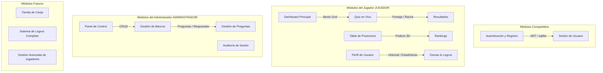

# 🗺️ Módulos y Fases de Desarrollo — Academic Pulse / QuizGame ISUTJ

Este documento detalla la planificación modular del sistema, identificando qué componentes se están desarrollando en la fase actual y cuáles quedan pendientes para futuras iteraciones de desarrollo.

---

## 🧩 1. Mapa de Módulos del Sistema

El sistema se compone de los siguientes módulos funcionales, divididos por accesibilidad de rol:

---

## 🚀 2. Fases de Desarrollo

El desarrollo del proyecto está organizado de manera incremental en fases. La fase actual sienta las bases de la arquitectura modular y el prototipo funcional con doble rol, mientras que las fases posteriores expandirán el alcance funcional del juego.

### 📍 Fase Actual: Core Modular y Prototipo Funcional de Roles (En Progreso)
**Objetivo:** Refactorizar el monolito `main.dart`, implementar el sistema de diseño centralizado, crear los modelos de datos tipados, conectar la base de datos real con la sesión y habilitar los flujos de navegación diferenciados para **Jugador** y **Administrador**.

* **Fase 1: Refactorización Estructural**
  - [ ] Crear la estructura de carpetas modular por capas y features (`core/`, `data/`, `features/`).
  - [ ] Dividir `main.dart` (2,124 líneas) en múltiples archivos enfocados y mantenibles.
  - [ ] Configurar el entrypoint limpio de la aplicación y la inyección básica de dependencias.
* **Fase 2: Sistema de Diseño Integrado (AppTheme)**
  - [ ] Añadir dependencias de `google_fonts` e `intl` a `pubspec.yaml`.
  - [ ] Crear `app_colors.dart`, `app_text_styles.dart` y `app_theme.dart` reflejando los tokens de `DESIGN.md`.
  - [ ] Configurar el tema claro/gamificado para el jugador y el tema limpio/moderno corporativo para el administrador.
* **Fase 3: Modelos de Datos Tipados**
  - [ ] Crear modelos Dart tipados (`UserModel`, `QuizBankModel`, `QuestionModel`, `AnswerModel`, `RankingModel`) con serialización `fromJson`/`toJson`.
  - [ ] Desacoplar la UI de los tipos dinámicos (`Map<String, dynamic>`) para garantizar robustez en tiempo de compilación.
* **Fase 4: Backend API - Endpoint de Perfil y Mejoras**
  - [ ] Crear el endpoint `GET /users/me/profile` en FastAPI para obtener información en tiempo real del usuario y estadísticas reales (`puntaje_total`, `quizzes_completados`).
  - [ ] Añadir esquema `UserProfileResponse` y actualizar `api_service.dart` para consumirlo.
  - [ ] Generar `.env.example` y asegurar exclusión de credenciales activas del control de versiones.
* **Fase 5: Navegación por Rol y Pantallas Base**
  - [ ] **Navegación JUGADOR (`PlayerNavigation`):**
    - [ ] Dashboard dinámico (`DashboardTab`) mostrando los puntos acumulados y el banco de preguntas más próximo a expirar (fallback por jerarquía o aleatorio si no hay fechas).
    - [ ] Rankings dinámicos (`RankingsTab`) con podium 3D del Top 3 y fila del usuario actual destacada.
    - [ ] Perfil de usuario (`ProfileTab`) con estadísticas consumidas desde el nuevo endpoint.
    - [ ] Cuestionario interactivo (`QuizScreen`) con temporizador, indicador de racha de respuestas correcta/incorrecta interactivo y cálculo dinámico de puntuación en caliente.
  - [ ] **Navegación ADMINISTRADOR (`AdminNavigation`):**
    - [ ] Panel de control limpio (Corporate Modern, sin gamificación ni gemas).
    - [ ] Lista de bancos de preguntas (`BanksListScreen`) con estados (Activo/Inactivo).
    - [ ] Formulario de creación y edición de bancos (`BankFormScreen`) con selector de rango de fechas.
    - [ ] Gestor de preguntas y respuestas (`QuestionsScreen`) para agregar contenido a un banco en tiempo real.
    - [ ] Perfil limpio del administrador (`AdminProfileTab`).
* **Fase 6: Alineación Visual Extrema**
  - [ ] Implementar efectos de Glassmorphism con `BackdropFilter` en las tarjetas del jugador.
  - [ ] Diseñar estados de feedback en el Quiz (borde verde + check para correcto; borde rojo + animación "shake" para incorrecto).
  - [ ] Añadir micro-animaciones en el podium de clasificación y transiciones fluidas.
* **Fase 7: Verificación y Pruebas**
  - [ ] Ejecutar análisis estático con `flutter analyze`.
  - [ ] Validar la compilación del frontend en modo debug y el funcionamiento del backend.
  - [ ] Realizar pruebas manuales exhaustivas de ambos flujos de navegación utilizando los usuarios semilla de la base de datos (`admin@admin.com` y `usuario@usuario.com`).

---

### 📅 Fases Futuras (Planificación de Próximos Sprints)

Estas fases amplían las funcionalidades de juego, expanden las capacidades del backend y preparan la aplicación para su lanzamiento pre-producción.

#### 🛡️ Fase 8: Seguridad y Robustez de Datos
* **Backend:**
  - [ ] **Validación en Servidor:** Implementar el endpoint `POST /answer` para validar respuestas en el backend. Eliminar el campo `es_correcta` del endpoint `GET /banks/{id}/play` para evitar que usuarios avanzados intercepten las respuestas correctas por red.
  - [ ] **Limpieza de Sesiones:** Implementar un job periódico en segundo plano (cron task) para purgar tokens de sesión expirados de la tabla `logins`.
  - [ ] **Historial de Respuestas:** Crear una tabla `respuestas_usuario` para almacenar qué opción eligió cada jugador en cada pregunta, permitiendo calcular métricas reales de precisión (`accuracy`) y auditar comportamientos inusuales.
* **Frontend:**
  - [ ] **Manejo Centralizado de Errores:** Implementar un middleware o wrapper HTTP que capture fallos de red (`SocketException`), timeouts y errores de parsing, mostrando diálogos amigables al usuario en lugar de colapsar las pantallas.

#### 🏪 Fase 9: Tienda de Canje y Economía de Puntos
* **Backend & Base de Datos:**
  - [ ] Crear las tablas `tienda_items` (becas, mercancía, beneficios universitarios) y `canjes_usuario` para registrar las transacciones.
  - [ ] Endpoint `POST /store/redeem` para validar puntos suficientes del usuario y procesar la solicitud de canje.
* **Frontend (Jugador):**
  - [ ] Agregar la pestaña de **Tienda** al menú de navegación del jugador.
  - [ ] Diseñar cards de productos con vista en detalle, precio en puntos/gemas y botón interactivo para canjear con confirmación modal.
* **Frontend (Administrador):**
  - [ ] Panel de administración de canjes para visualizar solicitudes de estudiantes, aprobar/rechazar canjes y actualizar el inventario de la tienda.

#### 🏆 Fase 10: Sistema de Logros y Progresión Avanzada
* **Backend:**
  - [ ] Crear tabla `logros` y `logros_usuario` para almacenar medallas obtenidas.
  - [ ] Lógica de evaluación para desbloquear logros en tiempo real (ej. "Mente Rápida" al responder 5 preguntas seguidas en menos de 3 segundos; "Lector Feroz" tras completar 10 cuestionarios).
* **Frontend (Jugador):**
  - [ ] Integrar dinámicamente la sección de logros en `ProfileTab`, convirtiendo los placeholders actuales en medallas reales a color o en escala de grises si están bloqueadas.
  - [ ] Notificación flotante ("toast" animado) cuando el jugador desbloquea un logro al finalizar un quiz.

#### 👥 Fase 11: Gestión Completa de Usuarios (Admin)
* **Backend:**
  - [ ] Endpoints de administración de usuarios `GET /admin/users`, `PUT /admin/users/{id}/status` (para activar/suspender cuentas).
* **Frontend (Administrador):**
  - [ ] Agregar pestaña de **Usuarios** en el panel de administrador.
  - [ ] Tabla interactiva con barra de búsqueda, filtrado por institución, y acciones rápidas para suspender cuentas, resetear contraseñas o cambiar roles.

#### 📲 Fase 12: Offline, Notificaciones y Despliegue
* **Soporte Offline:**
  - [ ] Lógica de caché en SQLite para descargar bancos de preguntas activos. Permitir jugar sin conexión a internet y sincronizar las puntuaciones una vez que se restablezca la red.
* **Notificaciones Push:**
  - [ ] Integración de Firebase Cloud Messaging (FCM) para notificar a los estudiantes cuando se publica un nuevo cuestionario o cuando está a punto de vencer un quiz destacado.
* **Infraestructura y Despliegue:**
  - [ ] Configurar Alembic para la gestión incremental de migraciones de la base de datos PostgreSQL.
  - [ ] Crear `Dockerfile` y `docker-compose.yml` para empaquetar de forma homogénea tanto la API de FastAPI como la base de datos.
  - [ ] Configurar scripts de integración continua (CI) para validar linters y formateadores de forma automática en cada commit.
